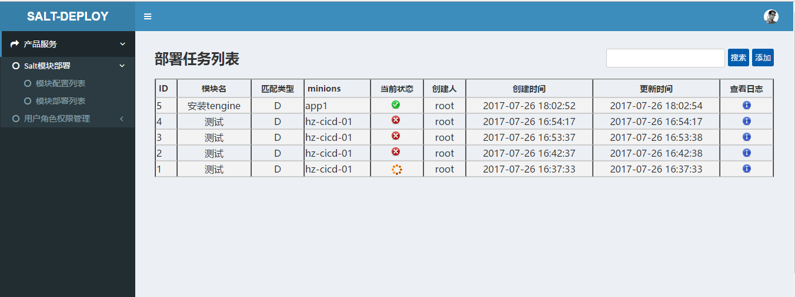

# Salt-deploy

运维云平台之saltstack批量模块部署系统，salt-deploy是基于Python、Django开发的用于saltstack批量模块部署。<br>
通常本系统和saltstack的master部署在同一台机器上。

### 部署运行环境
* Centos6.5 x86_64
* saltstack master
* Python2.7
* Virtualenv
* Django1.9.2
* Rabbitmq-server

### 安装部署

```
cd salt-deploy
sh update_python2.7.8.sh 
yum install rabbitmq-server -y
/etc/init.d/rabbitmq-server start
chkconfig rabbitmq-server on
pip install virtualenv
virtualenv ./env
source env/bin/activate
pip install -r pip_requirements.txt
python manage.py makemigrations
python manage.py migrate
python init.py
vim mysite/settings.py #手动修改配置SYS_API和EMAIL等配置
sh service.sh start
```

### 使用
1. 访问http://你的主机IP:8000 默认账户：admin 密码：password
2. 添加系统用户
  * 添加系统用户：点击右上角用户图标 --> 后台中心 --> 点击用户表添加用户 [注意：姓氏(last_name)填用户全名]
  * 将新添加系统用户加入op角色中
3. 添加模块配置 salt模块部署 --> 模块配置列表 --> 点击添加按钮添加模块配置
4. 添加模板部署任务 salt模块部署 --> 模块部署列表 --> 点击新建任务按钮添加模块部署任务
  
### 截图


### 技术交流

Email：飞龙 <hhr66@qq.com>
